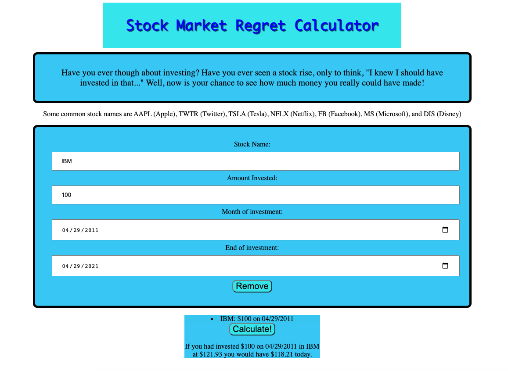

# Stock Market Regret Calculator
How much money could you have made on the stock market? This stock market regret calculator will determine exactly how much money you would have today if you invested into a company on a specific date!

## How it works

The user inputs their preferred stock, date, and investment amount. We have preloaded in a common stock, date, and investment amount, although those can all be easily changed. By hitting the 'Add' button, the user loads that data in to be evaluated. When they hit the 'Calculate' button, that data will be calculated using the AlphaVantage API, and the results will appear below, allowing the user to feel their regret mount.

### API
More information about the AlphaVantage API can be found
<a href="https://www.alphavantage.co/documentation/"> here.</a>

### Future features

In the future, I would like to add a few features. They include, but are not limited to: tracking a cumulative total of money gained/lost, turning that number into a 'regret score' to help gamify the website, adding the ability to submit multiple stocks at once (this is more a problem with the free API key than anything), and learning more about the API to deal with unexpected cases, allowing the user to input any date, rather than just Fridays.
